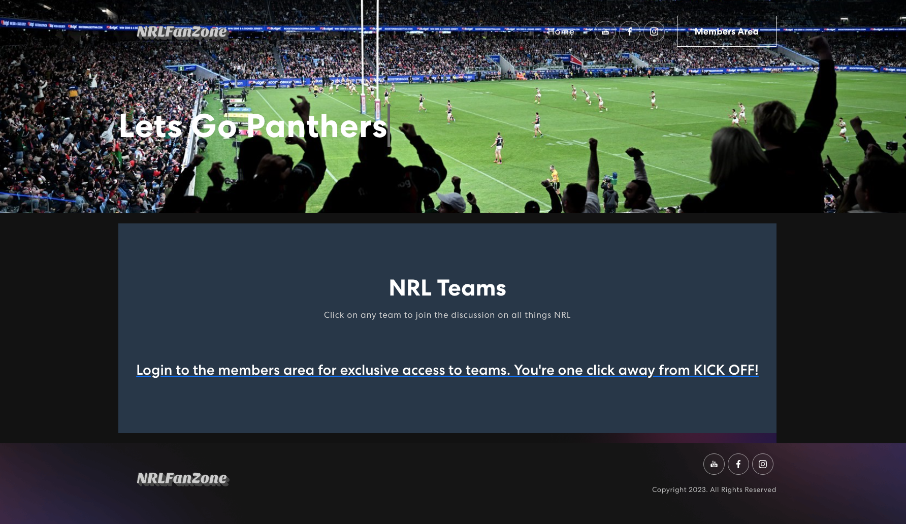
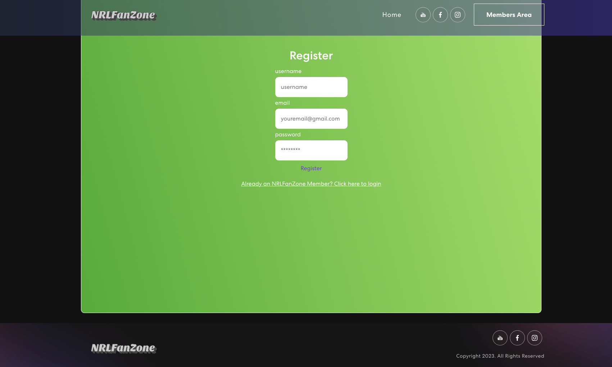
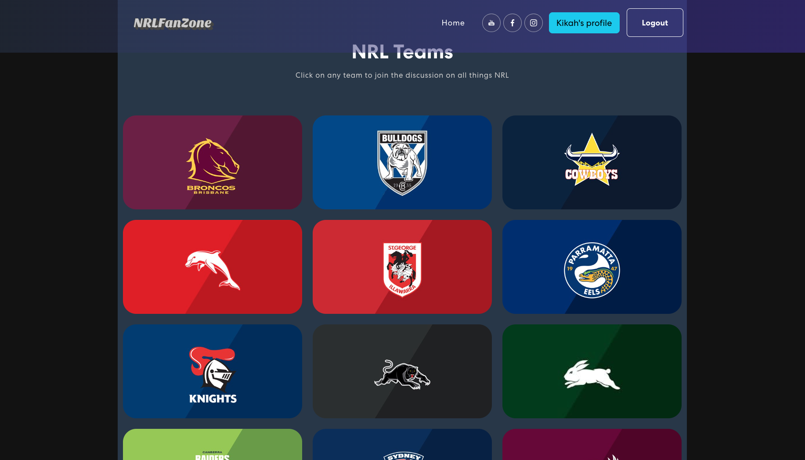
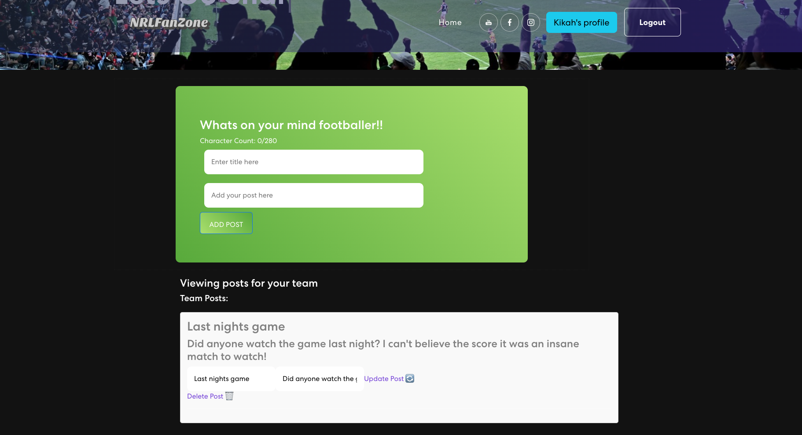

# NRLFanZone

## Table of Contents
- [Description](#project-description)
- [Links](#links)
- [Login](#login)
- [Usage](#usage)
- [Credits](#credits)
- [Documents](#documentation)
- [Questions](#questions)

## Project Description

We saw the opportunity to create a NRL FanZone application for NRL fans across the country to connect. Users register in the members area of the webiste to get exclusive access to the list of NRL teams and fan post discussions. All registered users can click onto a team and write a post to discuss whatever is on their mind with fellow fans

## Links

Have a look at our live page at [live page](https://nrlfanzone-d64c34d83843.herokuapp.com/) 

## Login

To login click the members area and register by entering a username, email and password. Inputs must be more than 3 characters in length.

## Usage

Open the page and you can find the register page. Already a current a user? Follow the link at the bottom of the register page to open the login page. Click logout to end the user session.

When you log in to the application page you will be presented with the home page.

Click on a team to view and create posts with fans across the world who follow the same team as you!

## Credits

The page was created by:

Andrew Clark- [Andrew's Github](https://github.com/Andy316C)

Corey Boughton- [Corey's Github](https://github.com/Corzah97)

Jasmine Neal- [Jasmine's Github](https://github.com/Jvn101)

## Documentation

View our pitch and presentation slides [here!](https://docs.google.com/presentation/d/1l9hdIiurlYcLXwYe9pPgjrFnDoyD194eUkZzSzXDfpQ/edit#slide=id.g7d932f3e7d_0_772)

## Questions

Please direct all questions and queries to any of our GitHub profiles above!